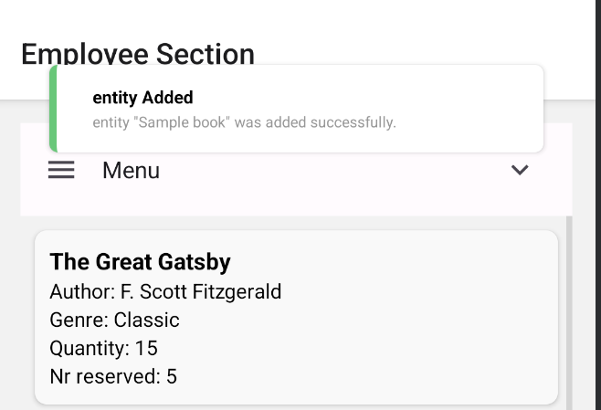

# 📚 Library Management System

Welcome to the **Library Management System**, a mobile application built using **Expo Go** with **React Native** for the frontend and **Node.js** for the backend. This app allows users to browse and interact with a library's collection, while employees can manage inventory efficiently.

## 🚀 Features

### 📖 Client Section (Users)
- ✅ **View Available Books**: Users can fetch and view a list of all books (title, author, and genre) using `GET /books`. Data remains accessible offline.
- ✅ **Reserve a Book**: Users can reserve a book using `PUT /reserve` (available online only).
- ✅ **List Reserved Books**: Users can check their reserved books using `GET /reserved`. Data remains accessible offline.
- ✅ **Borrow a Book**: Users can borrow a reserved book using `PUT /borrow` (available online only).
<p align="center">


</p>


### 👩‍💼 Employee Section
- ✅ **View All Books**: Employees can retrieve a sorted list of all books (by genre and quantity) using `GET /books`. The list updates each time they enter this section.
- ✅ **Add a New Book**: Employees can add new books using `POST /book`.
<p align="center">


</p>

### 🔔 Real-Time Features
- ✅ **Live Book Updates**: When a new book is added, the server sends a **WebSocket message** to all connected apps. The app displays a notification with the new book details.


### 🛠 Additional Features
- ✅ **Progress Indicators**: Displayed during server/DB operations.
- ✅ **Error Handling**: Errors are shown via toast/snackbar notifications, and logs are recorded for all server/DB interactions.

## 🏗 Tech Stack
- **Frontend**: React Native (Expo Go)
- **Backend**: Node.js
- **Database**: SQLite
- **WebSockets**: Real-time book updates

## 📂 Installation & Setup
### Prerequisites
- Install [Node.js](https://nodejs.org/)
- Install [Expo Go](https://expo.dev/)

### Steps
1. Clone the repository:
   ```sh
   git clone https://github.com/your-username/library-management.git
   cd library-management
   ```
2. Install dependencies:
   ```sh
   npm install
   ```
3. Start the backend server:
   ```sh
   cd server/
   npm install
   npm start
   ```
4. Start the frontend:
   ```sh
   npx expo start --localhost # to have access to the offline functions
   # or
   npx expo start
   ```
5. Scan the QR code with **Expo Go** to run the app on your mobile device.

## 📜 API Endpoints
| Endpoint       | Method | Description |
|---------------|--------|-------------|
| `/books`      | GET    | Retrieve all books |
| `/reserve`    | PUT    | Reserve a book |
| `/reserved`   | GET    | View reserved books |
| `/borrow`     | PUT    | Borrow a book |
| `/book`       | POST   | Add a new book |


---
